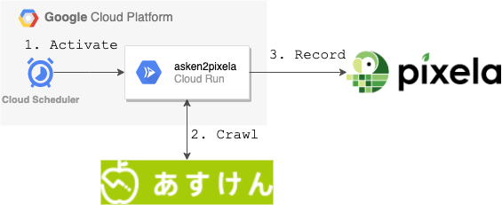

# asken2pixela

Transfer your [asken](https://www.asken.jp/) score to a [Pixela](https://pixe.la/) graph.

## Usage of Cloud Run version
The code in the directory `cloudrun` can be executed on GCP Cloud Run (+ Cloud Scheduler).



### 1. install
```bash
$ git clone https://github.com/jagijagijag1/asken2pixela
$ cd cloudrun
$ yarn install
```

### 2. set your asken & pixela information
Describe your asken and pixela info to `cloudrun/Dockerfile` einvironment variable.
```Dockerfile:Dockerfile
...
ENV TZ Asia/Tokyo
ENV ASKEN_EMAIL <your-login-email-address
ENV ASKEN_PASS <your-login-password>
ENV PIXELA_USER <your-pixela-user-id
ENV PIXELA__GRAPH <your-pixela-graph-id
ENV PIXELA_TOKEN <your-pixela-token>
...
```

### 3. put docker image on GCP & create Cloud Run
After setting your asken/pixela info & GCP project, execurte the following.
```bash
# build TypeScript code
$ yarn build

# build & push Dockerfile to GCP
$ gcloud builds submit --tag gcr.io/<your-projectr-id>/<your-image-name>

# create Cloud Run (use 512M memory to execute Puppeteer)
$ cloud beta run deploy <your-cloudrun-name> --image gcr.io//<your-projectr-id>/<your-image-name> --platform managed --region asia-northeast1 --allow-unauthenticated --memory 512Mi
```

then, you got Cloud Run endpoint url.
In accessing the endpoint, you can record yesterday's asken score to your pixela graph.

### Optional. create Clouod Scheduler job for periodic execution
You can achieve cron job with Cloud Scheduler.
```bash
# create Cloud Scheduler job (exe at 1:00 AM)
$ gcloud scheduler jobs create http <your-job-name> --schedule "00 01 * * *" --time-zone "Asia/Tokyo" --http-method=GET --uri="<your-cloudrun-endpoint>" --headers=Content-Type=application/json

# test run
$ gcloud scheduler jobs run <your-job-name>
```

## Usage of local batch version
The code in directory `local` can be locally executed to (1) retrieve asken score & data with puppeteer and (2) record retrived socre to Pixela graph.

### 1. install
```bash
$ git clone https://github.com/jagijagijag1/asken2pixela
$ cd local
$ yarn install
```

### 2. set your asken & pixela info
Describe your asken and pixela info to `local/batch-config.json`.
```json:local/batch-confg.json
{
  "askenEmail": "<your asken email address",
  "askenPass": "<your asken login password",
  "startDate": "<start date of asken socre you want to record, e.g. 20190929>",
  "endDate": "<end date of asken socre you want to record, e.g. 20191003>",
  "pixelaUser": "<your pixela user id>",
  "pixelaGraphId": "<your pixela graph for recording asken score",
  "pixelaToken": "<your pixela user token>"
}
```

### 3. run on local & record score in a batch manner
```bash
$ yarn start
```